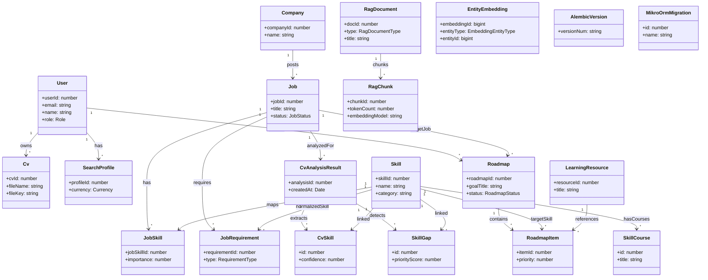

# README - Biểu đồ lớp từ Entities

Tài liệu này mô tả biểu đồ lớp (class diagram) được tổng hợp từ các entity trong thư mục `src/entities`.

## 1) Biểu đồ lớp (Mermaid)

## 2) Nhóm entity theo domain

- **User & Profile**: `User`, `Cv`, `SearchProfile`
- **Job Matching**: `Company`, `Job`, `Skill`, `JobSkill`, `JobRequirement`
- **Analysis**: `CvAnalysisResult`, `CvSkill`, `SkillGap`
- **Roadmap Learning**: `Roadmap`, `RoadmapItem`, `LearningResource`, `SkillCourse`
- **RAG Knowledge Base**: `RagDocument`, `RagChunk`, `EntityEmbedding`
- **Migration/System**: `AlembicVersion`, `MikroOrmMigration`

## 3) Ghi chú

- `Job` ↔ `Skill` là quan hệ nhiều-nhiều thông qua pivot entity `JobSkill`.
- `EntityEmbedding` là bảng embedding dùng chung theo cặp (`entityType`, `entityId`), không ràng buộc FK trực tiếp đến từng entity cụ thể.
- `AlembicVersion` và `MikroOrmMigration` phục vụ theo dõi migration, không tham gia nghiệp vụ chính.
