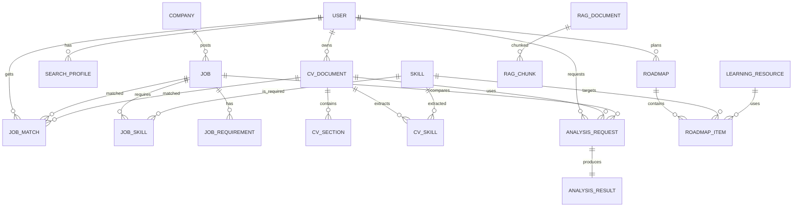

# Database design (PostgreSQL)

## Muc tieu
- Luu du lieu job crawl, CV, skill, ket qua matching, phan tich va roadmap.
- Ho tro RAG (chunk + embedding) va sinh roadmap theo tuan/thang.

## ERD (Mermaid)

## RAG pipeline mapping
1. Crawl jobs -> luu `Job.descriptionRaw`.
2. Clean/normalize JD -> `Job.descriptionClean`.
3. Extract skills/requirements -> `JobSkill`, `JobRequirement`.
4. Tao RAG docs (JD + course + skill guide) -> `RagDocument`.
5. Chunk + embed -> `RagChunk` (pgvector).
6. Query: CV + JD -> retrieve top-K chunks.
7. LLM sinh ket qua -> luu `AnalysisResult`, `Roadmap`, `RoadmapItem`.

## Scoring cong khai (rule-based)
- Skill match:
$$
\,f_{skill} = \frac{\sum_{s \in S_j \cap S_c} w_s \cdot p_s}{\sum_{s \in S_j} w_s}
$$
- Salary fit:
$$
\,f_{sal} = \frac{\max(0, \min(u_{max}, j_{max}) - \max(u_{min}, j_{min}))}{u_{max} - u_{min}}
$$
- Experience fit:
$$
\,f_{exp} = \min(1, \frac{y_c}{y_j})
$$
- Final score:
$$
Score = 0.55 f_{skill} + 0.15 f_{exp} + 0.10 f_{lvl} + 0.10 f_{sal} + 0.10 f_{loc}
$$

## Trong so de xuat
- Skill: 0.55
- Experience: 0.15
- Level: 0.10
- Salary: 0.10
- Location: 0.10

## Ghi chu ky thuat
- Dung enum native cua Postgres cho cac truong `@Enum`.
- Luu luong theo integer (cents) de tranh loi lam tron.
- Embedding su dung pgvector, can `CREATE EXTENSION vector`.
